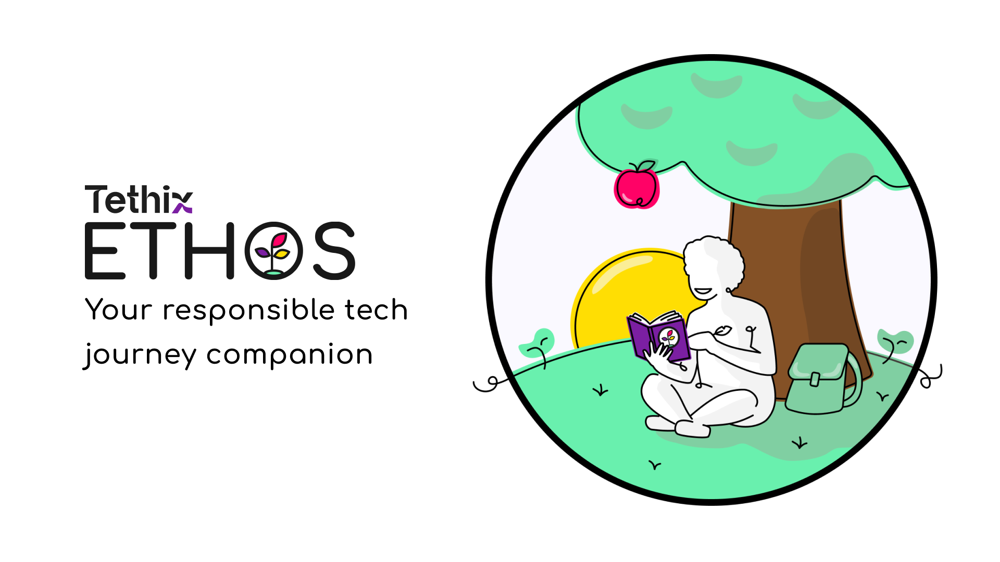

# About ETHOS



ETHOS is a tool that can support your responsible tech journey in different ways. You can find more about ETHOS on the about page or keep reading to find more about how you can run your own version. 

## Tech stack 

This version of ETHOS uses Jekyll 4 and deploys to GitHub Pages. 

The project uses the following plugins:

- [jekyll-feed](https://github.com/jekyll/jekyll-feed): for generating RSS feeds for different collections,
- [jekyll-seo-tag](https://github.com/jekyll/jekyll-seo-tag): for adding SEO-friendly tags in the header,
- [jekyll-paginate-v2](https://github.com/sverrirs/jekyll-paginate-v2): for adding pagination to collections and generating autopages for categories and tags,
- [jekyll-target-blank](https://keith-mifsud.me/projects/jekyll-target-blank): to open all external links in a new window in a safe way.

## Getting started on macOS

To get a local copy up and running follow these simple steps.

### Prerequisites

  Jeykyll requires Ruby 2.5 or above. Ruby 3 and above does not include webrick; this dependency will be included when you run bundle install (see below).

  ```sh
  brew install ruby
  ```  
  Install jekyll:

  ```sh
  gem install jekyll bundler
  ```

### Running the website locally

  Make sure all dependencies in your Gemfile are available to your application
  ```sh  
  bundle install
  ```
  Build the site and serve locally with or without live reload
  ```sh
  bundle exec jekyll serve
  bundle exec jekyll serve --livereload
  ```

If you run into any problems, Jekyll documentation has all the information you need to set up your machine, and build and run a Jekyll site: https://jekyllrb.com/docs/.

## Modifying content

The website uses **three collections** for three types of content:

- `_sparks`: discussion sparks,
- `_seeds`: seed sets with ethical principles and guidelines,
- `_tools`: ethical tools and techniques.

To add a new spark, seed set, or tool, just create a new Markdown file in the appropriate directory and follow the template of other files.

Pages dedicated to nurturing your ETHOS draw data from the data folder:
- **Reflect**: this page randomly selects a question defined in `_data/reflections.yml`.
- **Mirrors**: data related to mirrors are loaded from `_data/mirrors.yml`.

Other folders:  
- **Pages** such as `about` are defined in the `pages` folder, with the exception of `index.html`. 
- Pages reference **layouts** that can be found in `_layouts` folder, and layouts and pages might reference **includes** from the `_includes` folder. 
- **Assets** such ass CSS, JS, images, etc. can be found in the `assets` folder. 

## Questions or issues?

If you have any additional questions, we welcome new [discussions](https://github.com/tethix-ethos/ethos-jekyll/discussions) or [issue reports](https://github.com/tethix-ethos/ethos-jekyll/issues).
